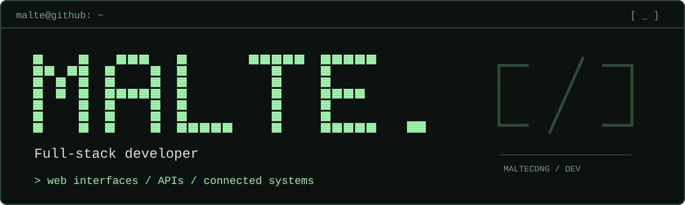

<picture>
  <source media="(prefers-color-scheme: dark)" srcset="./assets/profile-header-dark.svg">
  <source media="(prefers-color-scheme: light)" srcset="./assets/profile-header-light.svg">
  
</picture>

# Hi, I'm Malte.

I build practical software across the whole stack — from **React interfaces** and **real-time FastAPI services** to **Docker deployments** and **Raspberry Pi hardware**.

I care about the complete path from idea to running system: a clear interface, an explicit API, and an operational setup that remains understandable after launch.

[Explore my repositories →](https://github.com/MalteCDNG?tab=repositories)

## Featured build

### [BBS2-Hanken — climate-aware ventilation](https://github.com/MalteCDNG/BBS2-Hanken)

An end-to-end platform that monitors indoor and outdoor climate data, calculates dew points, visualizes historical readings, and controls ventilation hardware.

- **Observe:** live temperature and humidity, calculated dew points, and historical charts
- **Control:** fan status, manual overrides, protected settings, and sensor configuration
- **Operate:** a Docker Compose stack with a FastAPI backend, WebSocket updates, RavenDB, and Raspberry Pi GPIO integration

`React` · `TypeScript` · `Vite` · `FastAPI` · `Python` · `WebSockets` · `Docker` · `Raspberry Pi` · `RavenDB`

[View the architecture and setup →](https://github.com/MalteCDNG/BBS2-Hanken#readme)

## Selected toolbox

**Interfaces**  
React · TypeScript · Vite · Mantine · Chart.js

**Services**  
Python · FastAPI · REST APIs · WebSockets · JWT

**Systems & data**  
Docker · Linux · Raspberry Pi · GPIO · RavenDB · SQLite

---

Useful software. Clear interfaces. Systems that are built to run.
