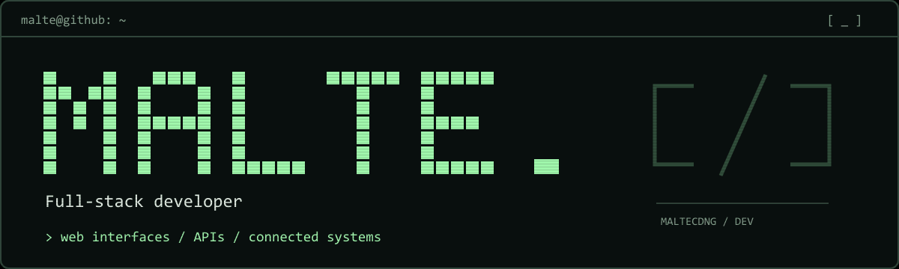

<picture>
  <source media="(prefers-reduced-motion: reduce)" srcset="./assets/profile-header-dark.svg">
  
</picture>

# Hi, I'm Malte 👋

**I build web applications and connect them to the systems behind them.**

My work spans React frontends, Python APIs, and Linux deployments — sometimes reaching beyond the browser to a Raspberry Pi. I enjoy bringing those pieces together: an interface that's easy to use, a service with clear behavior, and a setup I can understand and maintain.

## What I work on

- **Frontend development** — building web interfaces with React and TypeScript, including charts and data visualization.
- **Backend & real-time communication** — developing FastAPI services, REST APIs, and WebSocket connections.
- **Hardware & deployment** — connecting software to Raspberry Pi hardware and running applications with Docker on Linux.

## My toolbox

| Area | Technologies |
| --- | --- |
| **Frontend** | React · TypeScript · Vite · Mantine · Chart.js |
| **Backend** | Python · FastAPI · REST · WebSockets · JWT |
| **Data** | RavenDB · SQLite |
| **Infrastructure & hardware** | Docker · Linux · Raspberry Pi · GPIO |

## How I approach a project

I like working across the full path from the first screen to the running system. That means thinking about how the interface communicates with the API, how data moves through the application, and how everything will run after deployment.

My focus is practical: solve the problem, keep the moving parts understandable, and make the result useful.

[**Explore my repositories →**](https://github.com/MalteCDNG?tab=repositories)
